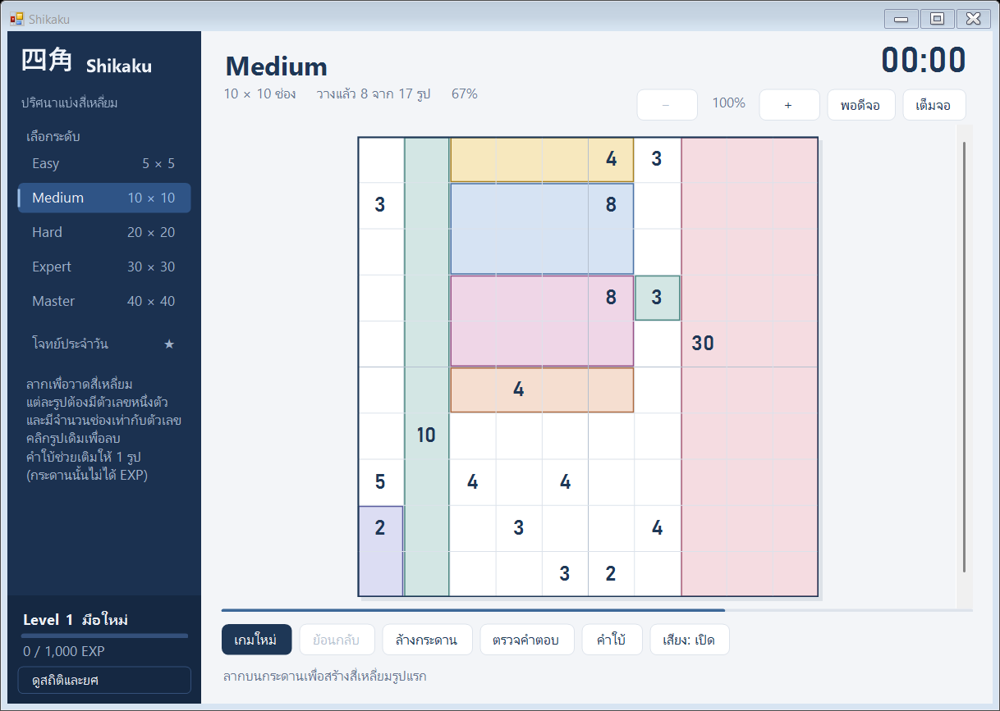

# Shikaku

[](https://github.com/trymybest888/shikaku/actions/workflows/build.yml)

เกมปริศนา Shikaku สำหรับ Windows โปรเจกต์ส่วนตัวของนักศึกษา

<p align="center">
  
</p>

## ดาวน์โหลด

ดาวน์โหลด `Shikaku.exe` จาก [Releases](https://github.com/trymybest888/shikaku/releases) แล้วเปิดได้ทันที ไม่ต้องติดตั้ง

ต้องการ Windows 10/11 และ .NET Framework 4.5 ขึ้นไป

หาก Windows SmartScreen เตือน ให้กด **More info → Run anyway** (โปรแกรมไม่มีลายเซ็นดิจิทัล)

## วิธีเล่น

ลากเมาส์เพื่อวาดสี่เหลี่ยมให้เต็มกระดาน แต่ละรูปต้องมีตัวเลขหนึ่งตัว และมีจำนวนช่องเท่ากับตัวเลขนั้น คลิกรูปที่วางแล้วเพื่อลบ

| ระดับ  | กระดาน | EXP   |
| ------ | ------ | ----: |
| Easy   | 5×5    | 25    |
| Medium | 10×10  | 100   |
| Hard   | 20×20  | 400   |
| Expert | 30×30  | 900   |
| Master | 40×40  | 1,600 |

## ฟีเจอร์

- โจทย์ทุกข้อมีคำตอบเดียว
- โจทย์ประจำวัน: กระดาน 10×10 ที่สร้างจากวันที่ ทุกคนได้โจทย์เดียวกัน
- คำใบ้: เติมให้ 1 รูป กระดานที่ใช้คำใบ้ไม่ได้ EXP
- บันทึกเกมอัตโนมัติ
- ทุก 1,000 EXP ขึ้น 1 Level

ข้อมูลเกมเก็บที่ `%LOCALAPPDATA%\Shikaku\` ลบโฟลเดอร์นี้เพื่อรีเซ็ต

## Build จากซอร์สโค้ด

ใช้ `csc.exe` ที่มากับ .NET Framework บน Windows

```powershell
powershell -ExecutionPolicy Bypass -File .\build-desktop.ps1
powershell -ExecutionPolicy Bypass -File .\tests\run-tests.ps1
```

Push tag ที่ขึ้นต้นด้วย `v` เพื่อสร้าง Release อัตโนมัติผ่าน GitHub Actions
